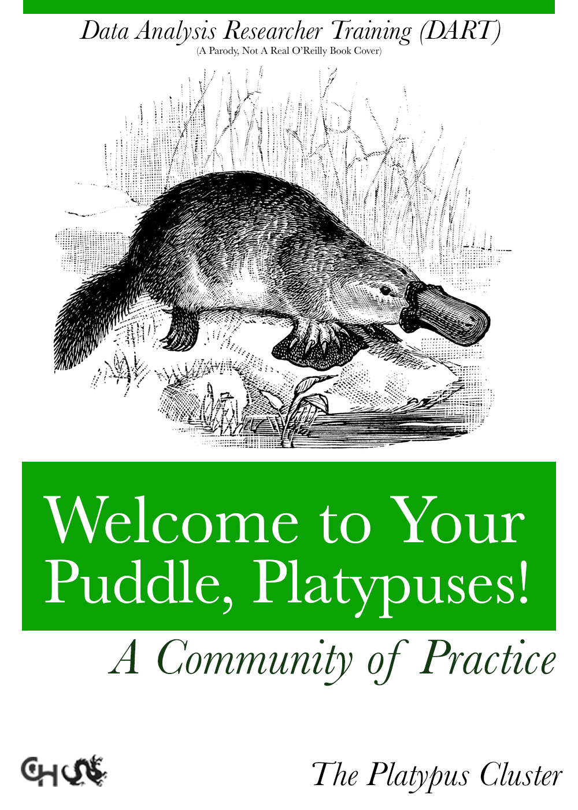

<!--
author:   Data Analysis Researcher Training team
email:    dart@chop.edu
version:  0.0.1
language: en
narrator: UK English Female

logo:     https://github.com/arcus/dart_orientation/blob/rmh-orientation/orientation/media/thinkific_cover.png

comment:  This is the material presented at the orientation meeting for the Data Analysis Researcher Training (DART) pilots, March 2022.
-->

# Communities of Practice slides
To be copied into main presentation

## Communities of Practice

**Practice** means you are doing something regularly.

**Community** means you are supporting others and others are supporting you.

You are creating a community of practice (CoP) for learning Data Science.

### Practice

Regular practice is how people get better at things!

Doing something regularly can look different for different people:

- Synchronous (do this at a set time) or asynchronous (have done this by a set time)
- Accountability: how do we know that it is done?
- In person or virtual practice?
- With others in a community?

### Community

Starting a supportive community involves:

- Introducing yourself and getting to know others
- Answering others kindly and helpfully
- Being willing to say when you don’t understand something
- Regular communication
    - How do you start a conversation?
    - Where do you have the conversation?

### Starting a conversation

Types of communication that build progress can include:

- Problem solving: “I’m stuck, can we work on this together?”

- Requests for information: “How do we log in to this platform?”

- Seeking experience: “Has anyone seen this error message?”

- Sharing assets: “I took some notes that you can use to get started.”

- Coordination: “Let’s create a shared document for these notes.”

Adapted from [Teaching Tech Together](https://teachtogether.tech/en/index.html#s:community)

### Structures to build community

- Slack workspace (join via the email you received)

- Email: you will be getting an email with all of your cohort’s addresses

- Regular support check-ins from the DART team

- Cohort nicknames:

### Ways to build your Community of Practice

- Active Slack or Email conversations
- Journal club
- Scheduled time to work in parallel on modules
- Scheduled check-ins to talk about progress
- Social gatherings to get to know each other and celebrate - accomplishments
- Anything else you want!

## In your breakout rooms

- Introduce yourselves
- Discuss how you want to build your community of practice
- Elect a point person to
  - share your cohort’s initial ideas
  - respond to the email you get later today, sharing those ideas with people who could not attend
