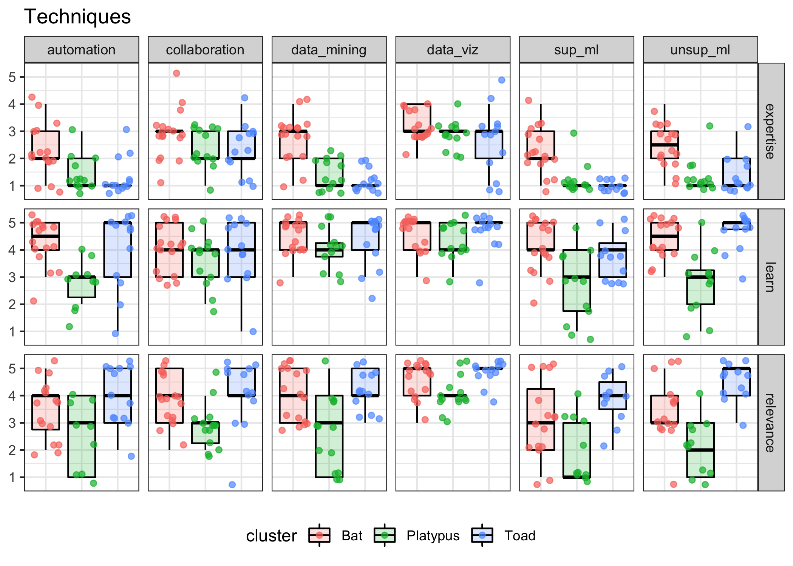
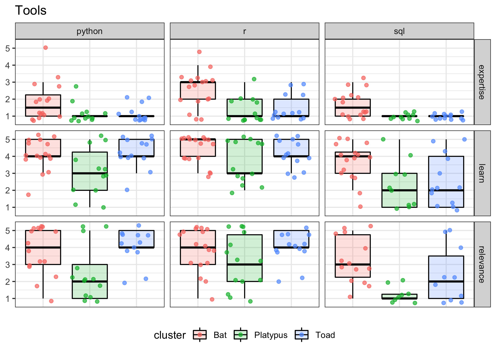

<!--

author:   Data Analysis Researcher Training team
email:    dart@chop.edu
version:  0.0.1
language: en
narrator: UK English Female

logo:     https://github.com/arcus/dart_orientation/blob/rmh-orientation/orientation/media/thinkific_cover.png

comment:  This is the material presented at the orientation meeting for the Data Analysis Researcher Training (DART) pilots, March 2022.
-->

# Data Analysis Researcher Training (DART) orientation

To see this document as an interactive LiaScript rendered version, click on the following link/badge:

## Data collection so far

Thank you so much for taking the time to respond to our questions!

This project is both operational and scientific for us --- we're building a new educational program, and we're planning to gather data on its effectiveness to share with the learning science community.

You are part of our **pilot program**. This is not yet an active research project (we'll be starting that next year), but your responses are invaluable in helping us hone our instrumentation and methods.

--{{0}}--
We've asked you to fill out two surveys since the fall, and a few of you even participated in more in-depth interviews with our team member Colleen as well. We're keenly aware of how valuable your time is, so part of what we want to share with you today is some information about how we've been using that data you've generously shared with us.

### Survey 1: Clustering learners

In November, we sent out a survey with questions about a number of data science tasks asking you to rate yourself on:

- current level of **expertise** in that task
- desire to **learn** that task
- **relevance** of that task to your current work

There were 16 topics, for a total of 48 responses, as well as a few additional questions about your previous data science training (if any) and preferred learning methods.

The main goal of this survey was to build **empirical learner personas** for your cohort.

#### Learner Personas: What they are

--{{0}}--
For this project, we're borrowing the idea of **personas** from UX design theory. In design, it's typical to create "personas" for whatever product you're building, as a way to ensure you're thinking about more than just a single typical user when you're deciding what to build and how. A designer might create several user personas, each with a detailed description of what that imaginary person is like, their needs, constraints, etc.

--{{0}}--
Usually designers just make up personas. In some cases, though, like ours, personas are empirically defined based on data gathered from a population of real users.

**What are personas?** (Pruitt and Adlin, 2006; Wilson, 2019; Zagallo et al., 2019)

- A design tool, to encourage products that will work for a wider range of people
- Typically, several different detailed descriptions of potential users
- Usually not empirically defined, but can be (ours are!)

#### Learner Personas: How we're using them

In our case, we're taking the idea of personas a bit further.
We are still using it as a design tool, since considering our learner personas helps to make sure we're creating educational content that will work for a wide range of people, coming at the content with different levels of expertise, different learning goals, different constraints.
But we're not just using the personas to inform our design.

We're using learner personas to provide a tailored educational experience to you, our learners. We are applying the learner personas to build two things:

- **educational pathways**
- **communities of practice**

--{{0}}--
For each learner persona, we're building a tailored educational pathway, that is to say a curated list of educational modules, presented in order, that will hopefully be a good match to the needs and interests of learners assigned to that persona. We're also connecting you with others with the same learner persona so you can form communities of practice to work through the content together.

#### Building learner personas

Hierarchical clustering analysis (Chen, 2022; Zagallo et al., 2019)

- works on small data sets
- works with wide data (more variables than observations)
- produces stable, definite clusters

--{{0}}--
There are a number of ways to do a cluster analysis, but we used [hierarchical clustering](https://stat.ethz.ch/R-manual/R-devel/library/stats/html/hclust.html) based on the squared Euclidean distances because it's a simple method that works for our small data set. It's also the method that was used in the other two existing studies on empirical learner personas.

#### Clustering analysis results

Here's the full dendrogram for the clustering analysis:

--{{0}}--
Each of the labels at the end of the branches represents one respondent, and the dendrogram builds up from the bottom.
Participants whose responses were closest to each other connect first, and after each new bundle the distances are re-calculated and the next closest pair is connected.
Connections from further away happen higher and higher in the tree, until eventually all the participants are connected into a single group.

--{{0}}--
We can "cut" the tree at any height to get the clusters at that that level of distance.
The overlaid boxes here show a cut that yields three clusters.
Those are the three clusters we're using for our learner personas.

--{{0}}--
To get more of an idea of what those clusters are like --- what those personas are like --- we can look at the pattern of responses by cluster.

#### Overall distributions

To get a feel for what these clusters do, let's examine the responses to one question: **How relevant to your current work is omics data analysis?**

--{{0}}--
Overall, we see most people rated omics data as highly relevant to their current work, although there were also a number of people who rated it as having low or medium relevance.

--{{0}}--
When we separate these responses out by cluster, we can see a few distinct patterns emerge.
In the first cluster, Toad, nearly everyone rated omics data as highly relevant. In the Bat cluster it's much more evenly spread, with almost comparable numbers of people who rate omics as high, medium, and low relevance. The final cluster, Platypus, is more at the extremes with people largely rating omics as very high or very low relevance.

#### Cluster distributions

### Survey 2: Pre-test measures

## References

Chen, D. (2022) A Pedagogical Approach to Create and Assess Domain-Specific Data Science Learning Materials in the Biomedical Sciences. [Doctoral dissertation, Virginia Tech]. https://vtechworks.lib.vt.edu/handle/10919/108073

Pruitt, J., and Adlin, T. (2006). The Persona Lifecycle: Keeping People in Mind Throughout Product Design (1st edition). Morgan Kaufmann.

Wilson, G. (2019). Teaching tech together: How to make your lessons work and build a teaching community around them. CRC Press.

Zagallo, P., McCourt, J., Idsardi, R., Smith, M. K., Urban-Lurain, M., Andrews, T. C., Haudek, K., Knight, J. K., Merrill, J., Nehm, R., and others. (2019). Through the eyes of faculty: Using personas as a tool for learner-centered professional development. CBE—Life Sciences Education, 18(4), ar62.
