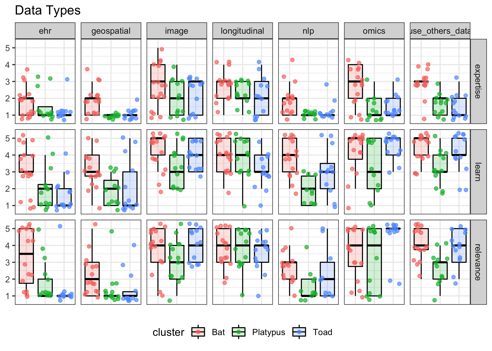

<!--
author:   Data Analysis Researcher Training team
email:    dart@chop.edu
version:  0.0.1
language: en
narrator: UK English Female

logo:     https://github.com/arcus/dart_orientation/blob/rmh-orientation/orientation/media/thinkific_cover.png

comment:  This is the material presented at the orientation meeting for the Data Analysis Researcher Training (DART) pilots, March 2022.
-->

# Welcome to DART

To see this document as an interactive LiaScript rendered version, click on the following link/badge: 

**Our goal**: To empower researchers to learn and use emerging data science methods.

## Motivation

There has been an explosion in the generation of healthcare and biomedical data in recent years (Agrawal & Prabakaran, 2020), including image data (radiology, neuroimaging, etc.), text data (patient records), complex time series and longitudinal data (continuous monitoring), and more. Growth in sequencing data alone is expected to eclipse other major generators of big data in the next few years, including astronomical data, Twitter, and YouTube (Stephens et al., 2015). This presents tremendous opportunities, but also tremendous challenges.

We know there's lots of ways to learn data science and we're not the first ones on the scene... but the stuff that's out there seems to not actually help researchers enough.

--{{0}}--
Traditional education can't keep up with the rapid developments in tools and techniques, and existing online resources are a lot of work to navigate. Researchers need the support to build skills and engage in on-going education throughout their careers.

## Our research interests

Although there is an obvious need for biomedical data science training, there is a dearth of evidence on best practices to support learners outside of a traditional data science classroom.
With this project, we aim to contribute on several fronts:

- instrumentation and methodology for identifying meaningful **learner personas** in a population of biomedical researchers
- instrumentation for assessment of proximal and distal **outcomes** in practical data science education
- measuring **effectiveness** of the program, including the opportunity to examine effects individually within learner clusters and interactions between clusters and content
- developing best practice recommendations for **accessible and inclusive** online technical teaching materials

## Pilot project

You are part of our **pilot program**. This is not yet an active research project (we'll be starting that next year), but your responses are invaluable in helping us hone our instrumentation and methods.

We're depending on you to let us know if you have feedback (positive or negative) on any part of the program: [dart@chop.edu](mailto:dart@chop.edu)

**Thank you!!**

## Clustering Analysis

In November, we sent out a survey with questions about a number of data science tasks asking you to rate yourself on:

- current level of **expertise** in that task
- desire to **learn** that task
- **relevance** of that task to your current work

There were 16 topics, for a total of 48 responses, as well as a few additional questions about your previous data science training (if any) and preferred learning methods.

The main goal of this survey was to build **empirical learner personas** for your cohort.

#### Learner personas: What they are

--{{0}}--
For this project, we're borrowing the idea of **personas** from UX design theory. In design, it's typical to create "personas" for whatever product you're building, as a way to ensure you're thinking about more than just a single typical user when you're deciding what to build and how. A designer might create several user personas, each with a detailed description of what that imaginary person is like, their needs, constraints, etc.

--{{0}}--
Usually designers just make up personas. In some cases, though, like ours, personas are empirically defined based on data gathered from a population of real users.

**What are personas?** (Pruitt and Adlin, 2006; Wilson, 2019; Zagallo et al., 2019)

- A design tool, to encourage products that will work for a wider range of people
- Typically, several different detailed descriptions of potential users
- Usually not empirically defined, but can be (ours are!)

#### Learner Personas: How we're using them

In our case, we're taking the idea of personas a bit further.
We are still using it as a design tool, since considering our learner personas helps to make sure we're creating educational content that will work for a wide range of people, coming at the content with different levels of expertise, different learning goals, different constraints.
But we're not just using the personas to inform our design.

We're using learner personas to provide a tailored educational experience to you, our learners. We are applying the learner personas to build two things:

- **educational pathways**
- **communities of practice**

--{{0}}--
For each learner persona, we're building a tailored educational pathway, that is to say a curated list of educational modules, presented in order, that will hopefully be a good match to the needs and interests of learners assigned to that persona.
We're also connecting you with others with the same learner persona so you can form communities of practice to build knowledge together.

#### Building learner personas

Hierarchical clustering analysis (Chen, 2022; Zagallo et al., 2019)

- works on small data sets
- works with wide data (more variables than observations)
- produces stable, definite clusters

--{{0}}--
There are a number of ways to do a cluster analysis, but we used [hierarchical clustering](https://stat.ethz.ch/R-manual/R-devel/library/stats/html/hclust.html) based on the squared Euclidean distances because it's a simple method that works for our small data set. It's also the method that was used in the other two existing studies on empirical learner personas.

#### Clustering analysis results

Here's the full dendrogram for the clustering analysis:

--{{0}}--
Each of the labels at the end of the branches represents one respondent, and the dendrogram builds up from the bottom.
Participants whose responses were closest to each other connect first, and after each new bundle the distances are re-calculated and the next closest pair is connected.
Connections from further away happen higher and higher in the tree, until eventually all the participants are connected into a single group.

--{{0}}--
We can "cut" the tree at any height to get the clusters at that that level of distance.
The overlaid boxes here show a cut that yields three clusters.
Those are the three clusters we're using for our learner personas.
To have a handy way to refer to them, we named each cluster after an animal: Bats, Platypuses, and Toads.

--{{0}}--
To get more of an idea of what those clusters are like --- what those personas are like --- we can look at the pattern of responses by cluster.

#### Cluster distributions

--{{0}}--
The plots below show distributions by cluster for each of the expertise, desire to learn, and relevance questions for the 16 different data science tasks plotted by topic (data types, techniques, and tools).

--{{0}}--
There is a lot of variability within each cluster, but there are also clear differences between clusters, allowing us to tune our approach for each to best meet their learning goals.
It is also our hope that clustering learners into personas this way will yield communities of practice that are more focused and therefore more valuable and engaging to participants. You have a lot in common with the other folks in your cluster, even if you differ in more obvious ways like research topic or career stage.

### Caveats

**What if your assigned learner persona is a bad fit?** That's valuable for us to know!

- This methodology is new and largely untested. Does the clustering approach work?
- We only have a tiny slice of what defines you as a researcher and learner. Did we fail to ask important questions?
- Extrapolating from the clusters to the educational pathways is difficult. Are we missing the mark?

--{{0}}--
We're also aware that you provided these responses back in November --- a lot can change in a few months, and some of you would maybe provide very different answers if you filled out the same survey again now.

--{{0}}--
That said, for the purposes of the pilot program we'd like you to stay in your originally assigned clusters so we can evaluate their effectiveness.

## Content creation

We're building content that directly addresses the goals in the [NIH Strategic Plan for Data Science](https://datascience.nih.gov/nih-strategic-plan-data-science).

### Modules

This program is composed of **modules**:

- asynchronous, short (1 hour or less), practical, and focused on clearly defined learning objectives
- free-standing, with no technical or data dependencies
- inclusive and accessible
- publicly documented and freely available

--{{0}}--
Our goal is to provide a large catalog of modular lessons covering a wide range of topics and expertise levels so that we can recommend tailored, efficient learning pathways to meet a range of learning goals and career trajectories.
Modules are short, practical, and focused, so you should be able to quickly evaluate whether a given module will be a good use of your time.

--{{0}}--
Modules are also designed to be free-standing, meaning that although we will be providing them in recommended sequences, you should be able to skip ones that cover content you already know. No module will require you to have completed any previous modules in the series.

--{{0}}--
We're working hard to make our content as accessible and inclusive as possible. There are a number of useful customization options for the content, and we're prioritizing access for folks using a variety of assistive technology tools. That said, we know it's not perfect, and if you find yourself encountering frustration using our materials, we will be very grateful to hear that feedback from you --- we want to make our content better.

--{{0}}--
Everything we're creating for this program is also publicly documented and freely available on GitHub, licensed with a creative commons license to facilitate sharing and reuse. For the purposes of the pilot, we appreciate you accessing the content through the platform we provide, since that gives us the opportunity to track use. But eventually everything will be freely available to anyone in the world.

### Pathways

There will be a separate educational pathway for each learner persona, beginning with a common "on ramp" for all learners.

--{{0}}--
We have the on ramp built for you to get started on now. Over the coming weeks, we'll be building the next stage of content, which will diverge into three separate pathways.

Pathways are provided in [thinkific](https://dart-chop.thinkific.com/):

## Communities of practice

In addition to building educational pathways, we're using your learner personas to define communities of practice.

Our goal is to help researchers move from tentative participation in the broader data community --- which loosely  spans user groups, regular gatherings, online spaces, etc. --- into participation in a more focused community centered on domain and skill goals.

## References

Agrawal, R., & Prabakaran, S. (2020). Big data in digital healthcare: Lessons learnt and recommendations for general practice. Heredity, 124(4), 525–534. https://doi.org/10.1038/s41437-020-0303-2

Stephens ZD, Lee SY, Faghri F, Campbell RH, Zhai C, Efron MJ, et al. (2015) Big Data: Astronomical or Genomical? PLoS Biol 13(7): e1002195. https://doi.org/10.1371/journal.pbio.1002195
